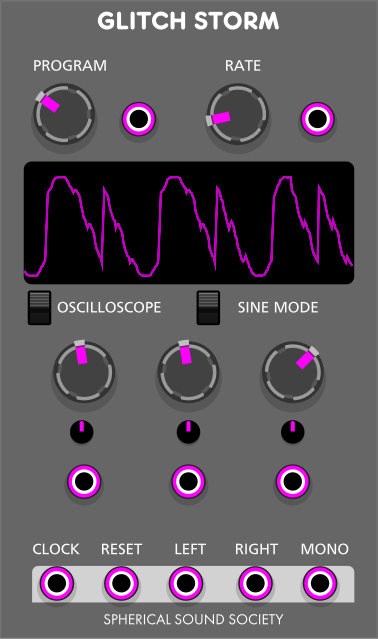

# GlitchStorm

GlitchStorm is a bytebeat machine inspired based on a hardware synth that I produce. It sounds raw, chiptuneish and 8-Bits. This implementation has native stereo output produced directly in the synthesis engine. It has a new sine implementation totally original and developed by us that turns the output into a sineish waveform that sounds kind of more delicated and with FM overtones

## Parameters

- **Program Knob**: Selects the program (or equation) to run
- **Rate Knob**: Controls the sample rate (or pitch) of the 
- **A, B, C**: These knobs affect the internal bitwise operations of the glitch engine. Small changes can lead to radically different sonic results.
- **Attenuverters**: Located over the CV inputs, these control the depth and polarity of the incoming modulation.

## Inputs

- **RESET**: Restarts the engine
CV control for all the parameters

## Outputs

- **CLOCK**: It emits its clock
- **LEFT**: Left output
- **RIGHT**: Right output
- **MONO**: Mono output

